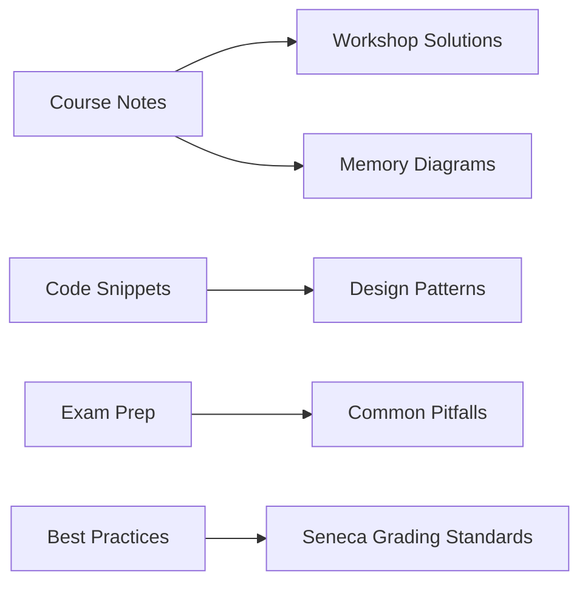

# 🏗️ OOP244 Core | C++ Object-Oriented Programming

**Your complete Seneca OOP244 survival Kit:**  
*Notes • Topic-wise-code snippets • Cheatsheets • Exam Prep*

<div align="center">
  
</div>

## 📅 Weekly Materials Breakdown

| Week | Topics Covered |
|------|----------------|
| 1 | OOP Basics, Object Terminology, Modular Programming, Types & References, Dynamic Memory |
| 2 | Types & References Review, Dynamic Memory, Member Functions, Privacy |
| 3 | Member Functions, Privacy, Construction/Destruction, The Current Object |
| 4 | Construction/Destruction, Current Object, Member Operators, Helper Functions |
| 5 | Member Operators, Helper Functions, Classes & Resources, I/O Operators |
| 6 | Classes & Resources, I/O Operators (continued), Refinements |
| 7 | I/O Operators Refinements, Derived Classes, Functions in Hierarchy |
| 8 | Derived Classes, Hierarchy Functions, Virtual Functions, Abstract Base Classes |
| 9 | Virtual Functions, Abstract Base Classes, Derived Class with Resources |
| 10 | Derived Class with Resources, Function Templates |
| 11 | Function Templates, I/O Refinements, Polymorphism Overview |
| 12 | I/O Refinements Review, Polymorphism, Language Standards |
| 13 | Language Standards, Open Q&A Session |

## 📦 What's Inside



### 🧠 Core Concepts Covered
- Classes & Objects
- Dynamic Memory Allocation
- Inheritance & Polymorphism
- Abstract Base Classes
- STL Containers
- Move/Copy Semantics
- RAII Pattern

## 🚀 Quick Start

```bash
# Clone the repository
git clone https://github.com/your-username/OOP244-Core.git

# Navigate to specific topic
cd OOP244-Core/Workshops/WS05-Inheritance
```

## 📚 Resource Map

| Folder | Contents |
|--------|----------|
| `/Notes` | Annotated lecture summaries |
| `/Workshops` | Lab solutions with explanations |
| `/Cheatsheets` | One-page concept references |
| `/Samples` | Seneca-approved code patterns |
| `/Exams` | Previous tests with solutions |

## 💡 Pro Tips

```cpp
// Golden OOP244 Rule:
// Always follow Rule-of-3/5/0
class ResourceHolder {
    Resource* ptr;
public:
    // Constructor
    ResourceHolder() : ptr(new Resource()) {}
    
    // Destructor 
    ~ResourceHolder() { delete ptr; }
    
    // Copy Constructor
    ResourceHolder(const ResourceHolder& other) {
        ptr = new Resource(*other.ptr);
    }
    
    // Copy Assignment
    ResourceHolder& operator=(ResourceHolder other) {
        std::swap(ptr, other.ptr);
        return *this;
    }
};
```

## 🌟 Featured Content

<div align="center">
  
  
  
</div>

## 📌 Seneca-Specific

- **Grading Rubrics** for workshops
- **Common Mistakes** in assignments
- **TA Feedback** compilation
- **Final Exam** pattern analysis

## 🤝 Contribution

Found an error or have improvements?  
[Open an Issue](https://github.com/your-username/OOP244-Core/issues) or submit a PR!

---

<div align="center">
  
  
  
</div>
```
